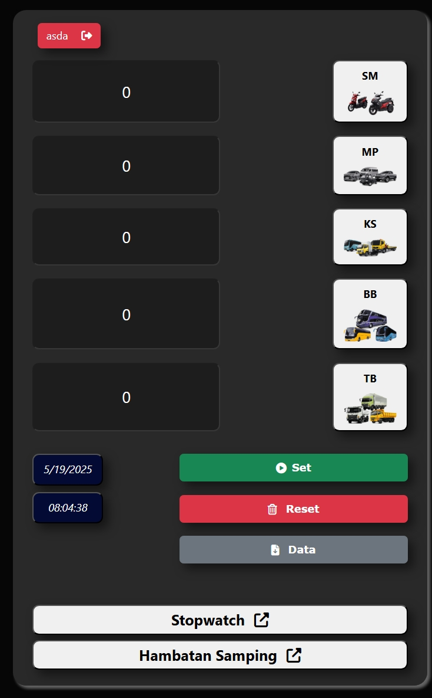
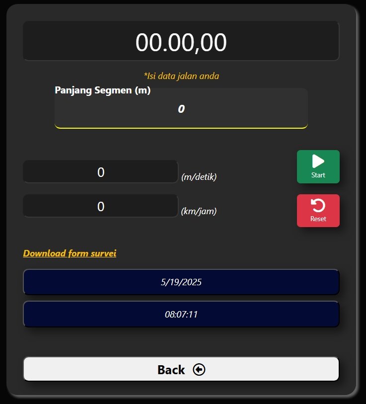

# Traffic Counter

A web-based application for counting and tracking traffic data.

## Features

- Real-time traffic counting
- Data visualization and reporting
- Historical data tracking
- User-friendly interface
- Stop watch functionality
- Export data capabilities

## Tech Stack

- Frontend: HTML, CSS, Javascript
- Backend: PHP (v8.1+)
- Database: Mysql
- Additional Libraries:
  - [PhpSpreadsheet](https://github.com/PHPOffice/PhpSpreadsheet) for data export
  - Various PHP polyfills for compatibility

## Installation

### Prerequisites

- PHP 8.1 or higher (64-bit build)
- Composer
- Mysql database

## Screenshots

Main Page

    

Stop watch

    

## License

This project is licensed under the MIT License.
